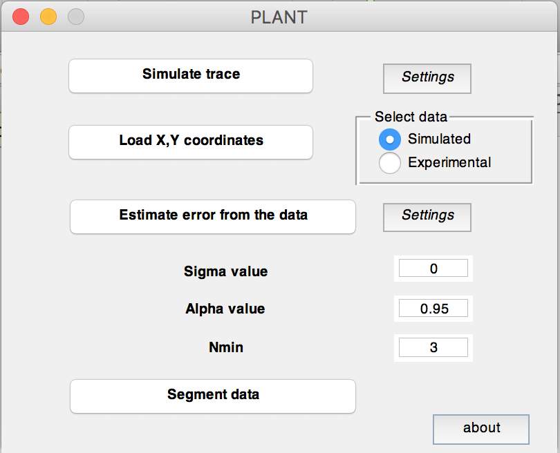

# PLANT
Matlab GUI to reconstruct noisy trajectory composed by consecutive linear regions of various duration and slope. The algorithm is composed by two main sequential blocks, the first of which (WINLINFIT) recursively selects a set of candidate change points associated to a potential variation in the slope by means of least square fitting and likelihood evaluation, whereas the second (MERGING) refines the number of change points by hierarchically executing a hypothesis test on adjacent segments.  The code requires an estimation of the noise standard deviation that can be obtained from calibration measurements, or estimated directly from the trace under analysis. 

## Getting Started
These instructions will allow you to run the code on experimental data, or to generate a simulated dataset and then analyze it.

### Prerequisites
Matlab 2013a (The Mathworks Inc., www.mathworks.com) or later.

## Running the code
Run PLANT.m in Matlab. The initialized GUI will open. 

### Simulate trace
Pushing the "Simulate trace" button generates a simulated trace according to the parameters defined in "Settings". The trajectory is saved as a .txt file named "simtrace". By pushing the Settings button a pop-up window will open and allow to set the simulation parameters: the number of points composing the trace, the standard deviation of the Gaussian noise corrupting the trajectory, the minimum and maximum velocity, and the average segment duration. Velocities are generated randomly from a uniform distribution. The duration of segments is generated randomly from an exponential distribution. The trace is generated at a variable time resolution (such to have 10 data points per segment) and then resampled. The results are plotted in blue, the change points are in green (shifted up for clarity).

### Load X,Y coordinates
The radio button on the right of the "Load X,Y coordinates" button allow to select if a "Simulated" trace (the last generated) or a different file ("Experimental") want to be used for the following analysis. In the latter case, a window will pop up asking to choose the file to be loaded.  The file must be a *.txt, composed by two column of double precision numbers. An example of an experimental trace corresponding to the y-position of the trajectory of a T-cell moving on endothelial cells under shear flow is provided in the file "example_trace.txt".

### Estimate error from the data
It allows to estimate the noise standard deviation directly from the trace under analysis, by means of a routine that calculates it from the fit of the median of the standard deviation evaluated on all the possible segments longer than NMIN. The latter value and the total number of points to fit can be modified by pushing on "Settings". 

### Sigma value
If available from calibration measurements, the  standard deviation value can be input directly.

### Alpha value
Level of confidence to accept/reject the hypothesis that two neighboring segments belong to the same linear region in the MERGING routine according to the Fisher-Snedecor distribution.

### NMIN
Minimum segment length to be considered for the analysis. Must be larger than 2 in order to perform a linear fit on a number of data points larger than the number of free parameters.

### Segment data
Run the segmentation routine and display the results in a plot. Original data are in blue, reconstructed trace in red and change points in magenta (shifted up for clarity). The output trace is saved as "segmenteddata.txt".

